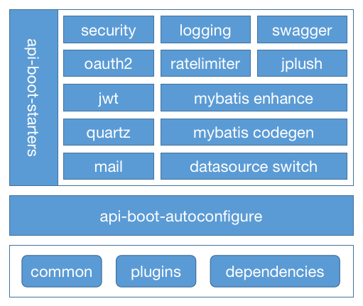

`ApiBoot`是接口服务的落地解决方案，提供了一系列开箱即用的组件，通过封装来简化主流第三方框架的集成，从而提高开发者开发效率、学习成本、降低入门门槛，真正的实现开箱即用！！！

Why Use ApiBoot ? ：
- **站在巨人的肩膀上**：`ApiBoot`依赖于`SpringBoot`，只要是`SpringBoot应用程序`就可以开箱使用`ApiBoot组件`
- **低门槛**：为`Java开发者`提供低门槛第三方框架集成方案，让复杂框架的集成变成只需添加依赖、简单配置即可
- **上手快**：对`SpringBoot`简单了解就可以直接上手，可为移动端、网页端等多个端点提供丰富的安全服务接口
- **高内聚**：各个组件可独立使用，独自完成业务封装，不再冗余你的应用程序。
- **自动化配置**：极简配置，甚至有的组件都可以不配置（使用默认值）就可以实现快速接入

## 架构层级图



## 安装 & 入门

组件的详细使用文档请查看[组件库](/docs/category/组件库)，访问[第一个ApiBoot应用程序](/docs/out-box/first-apiboot-application)快速构建基于ApiBoot的应用程序.

如果你是使用Maven来构建项目，你需要添加ApiBoot的版本依赖到你的pom.xml文件内，如下所示：

```xml
<dependencyManagement>
  <dependencies>
    <!--ApiBoot版本依赖-->
    <dependency>
      <groupId>org.minbox.framework</groupId>
      <artifactId>api-boot-dependencies</artifactId>
      <version>${lastVersion}</version>
      <scope>import</scope>
      <type>pom</type>
    </dependency>
  </dependencies>
</dependencyManagement>
```

Maven仓库最新版本：[](https://search.maven.org/search?q=g:org.minbox.framework)

> 注意：**lastVersion**需要替换为最新的ApiBoot版本，如果无法查看最新版本请访问[search.maven.org](https://search.maven.org/artifact/org.minbox.framework/api-boot-dependencies)。

版本依赖添加完成后，我们接下来就可以进行添加项目内所需要的ApiBoot组件，下面是使用分布式链路组件minbox-logging示例：

```xml
<dependencies>
  <!--ApiBoot MinBox Logging-->
  <dependency>
    <groupId>org.minbox.framework</groupId>
    <artifactId>api-boot-starter-logging</artifactId>
  </dependency>
</dependencies>
```

## 源码仓库

如果在使用ApiBoot的过程中遇到了问题，你可以通过源码仓库提issues途径获取帮助！

- GitHub（主仓库）：[minbox-projects/api-boot](https://github.com/minbox-projects/api-boot)
- Gitee（从仓库）：[minbox-projects/api-boot](https://gitee.com/minbox-projects/api-boot)

## 使用示例

ApiBoot提供了每一个组件的使用示例，在源码[api-boot-samples](https://gitee.com/minbox-projects/api-boot/tree/master/api-boot-samples)目录下根据组件名归类。

## 使用指南

请访问作者博客<a href="https://blog.yuqiyu.com" target="_blank">恒宇少年De成长之路</a>获取ApiBoot、MinBox开源组织内开源框架的最新的使用指南。
